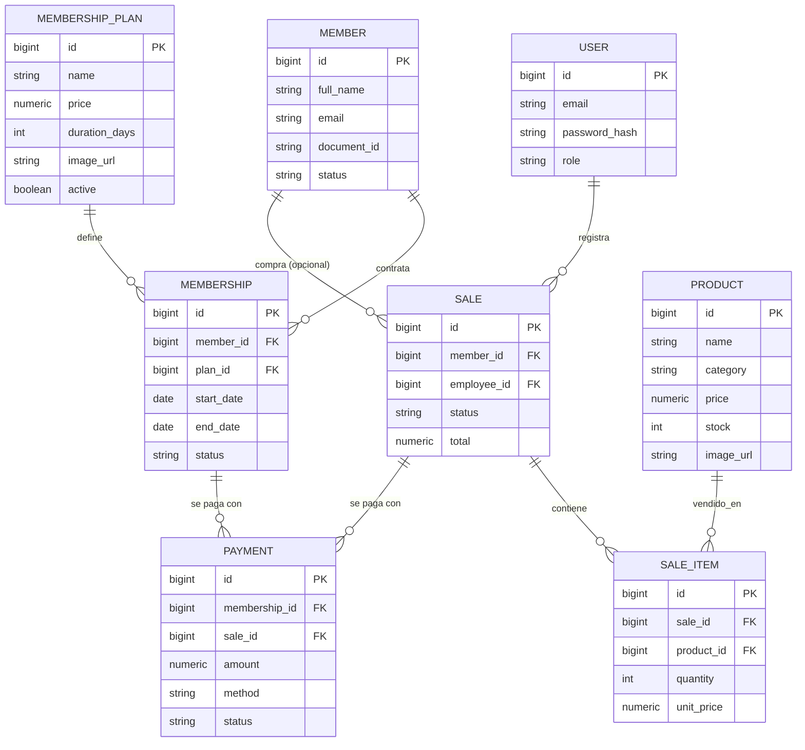

# GymFlow

Sistema de gestión para gimnasios: clientes, membresías, inventario, ventas y reportes. Construido como alternativa "más pequeña pero mejor construida" frente a un ERP genérico de gimnasios — el foco está en decisiones de ingeniería sólidas (seguridad real, trazabilidad, migraciones versionadas) antes que en volumen de funciones.

## Stack

**Backend** — Java 21, Spring Boot 3.5, Spring Security (JWT), Spring Data JPA, PostgreSQL, Flyway, springdoc-openapi.
**Frontend** — React 19, TypeScript, Vite, TanStack Query, React Router, React Hook Form + Zod, Tailwind CSS v4.

## Arquitectura

```
┌────────────────────────────────┐
│   React 19 + TypeScript         │
│   Vite · React Router           │
│   TanStack Query (fetch/cache)  │
│   React Hook Form + Zod         │
│   Tailwind CSS                  │
└───────────────┬──────────────────┘
                │ REST + JWT (Bearer token)
┌───────────────▼──────────────────┐
│         Spring Boot 3.5           │
│  Controllers → Services → Repos   │
├────────────────────────────────────┤
│ auth · member · membership ·      │
│ payment · inventory · sales ·     │
│ dashboard · audit                 │
├────────────────────────────────────┤
│  Spring Security (JWT filter)     │
│  Spring Data JPA / Hibernate      │
│  Flyway (migraciones versionadas) │
└───────────────┬────────────────────┘
                │
         ┌──────▼──────┐
         │ PostgreSQL  │
         └─────────────┘
```

Organización por **package-by-feature** en ambos lados: cada módulo de negocio (`member`, `sales`, `inventory`...) agrupa su propio controller, service, repository y DTOs, en vez de separar por capa técnica.

## Modelo de datos



## Puesta en marcha local

**Requisitos:** Java 21, Node.js 20+, Docker.

```bash
# 1. Base de datos
cd api
docker compose up -d

# 2. Backend (levanta en :8080, Flyway aplica las migraciones automáticamente)
./mvnw spring-boot:run

# 3. Frontend, en otra terminal (levanta en :5173)
cd web
npm install
npm run dev
```

Usuario semilla: `admin@gymflow.com` / contraseña definida en `V2__seed_admin.sql`.

Documentación interactiva de la API: `http://localhost:8080/swagger-ui.html`

## Reglas de negocio

- Una **membresía** solo pasa a `ACTIVE` cuando existe un `Payment` en estado `COMPLETED` asociado a ella. Contratar un plan crea la membresía en `PENDING`.
- Una **venta** descuenta stock de forma transaccional; el backend rechaza vender más unidades de las disponibles, incluso si dos ventas llegan casi al mismo tiempo.
- El precio de cada `SaleItem` se congela al momento de la venta (`unitPrice`), independiente de si el precio del producto cambia después — así el historial de ventas nunca se recalcula solo.
- Los roles son `ADMIN` (acceso total, incluye dashboard, auditoría, y eliminar/desactivar registros) y `RECEPCIONISTA` (operación diaria: clientes, ventas, cobros — sin acceso a eliminar productos ni ver el resumen financiero).
- Cada acción sensible (crear venta, cancelar membresía, registrar pago, desactivar cliente) queda en el log de auditoría con quién la hizo y cuándo, vía un aspecto de AOP (`AuditAspect` + `@Auditable`) — no está incrustado a mano en cada servicio.

## Seguridad

- Autenticación stateless con JWT (`HS512`), token con expiración corta.
- Rutas protegidas por rol con `@PreAuthorize("hasRole('ADMIN')")` a nivel de método, no solo de URL.
- Contraseñas con BCrypt, nunca en texto plano ni en logs.
- CORS restringido explícitamente al origen del frontend.

## Estructura del repositorio

```
gimnasio/
├── api/     — backend Spring Boot
│   └── src/main/resources/db/migration/   — historial de Flyway, nunca se edita retroactivamente
└── web/     — frontend React + TypeScript
    └── src/features/                       — un directorio por módulo de negocio
```

## Roadmap (fuera de alcance por ahora)

Estas funciones se dejaron fuera a propósito para no diluir el foco del proyecto:

- Asistencia por QR para el ingreso de socios
- Gestión de entrenadores y asignación de rutinas
- Reserva de clases grupales
- Refresh token real (cookie `httpOnly`) — hoy la sesión expira y exige volver a loguearse
- Snapshot de precio en `Membership` (cobrar lo pactado al contratar, no el precio vigente del plan)

## Licencia

Proyecto personal de portafolio.